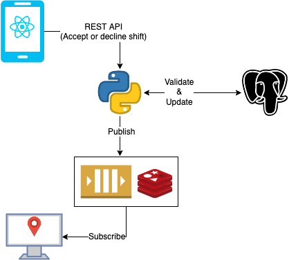
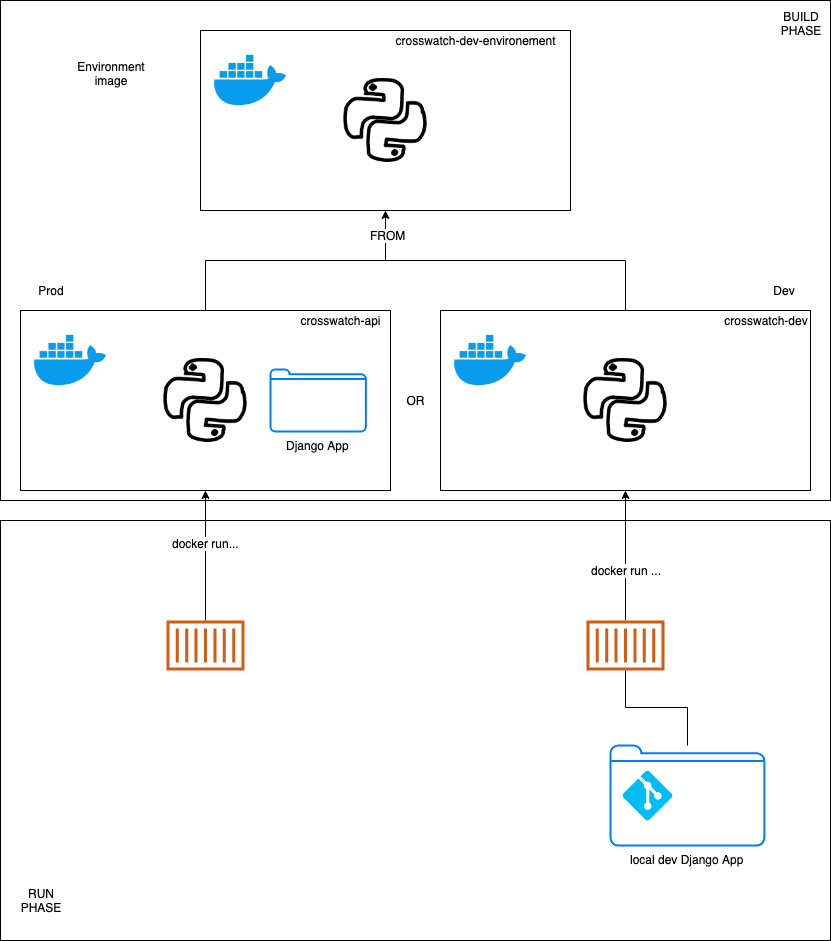

# acg-crossing-app REST API
The REST API for the ACG Crossing Guard App (RHoK #11).

1. This app will recieve REST API requests we generate from a react web app (and hopefully we can get this working in a way where folks can just call in with their phone).
2. That will trigger validation and updates to the crossing guard shifts in the database.
3. Finally it will Publish the update to redis, where the live map can subscribe and consume this data to show who is able to make it or not.

In the future, we should have a scheduled task for building a new set of shifts every day.

**TODO**: Move over as much of the documentation as we can to Notion of Confluence or something.



# Dev Dependencies (Docker)
## Dev Dependencies (Mac)
* Docker for Mac

## Dev Dependencies (Windows)
* Docker Desktop for Windows

## Dev Dependencies (Linux)
* [Docker Engine](https://docs.docker.com/install/linux/docker-ce/ubuntu/)
* [Docker Compose](https://docs.docker.com/compose/install/)

# Dev Workflow (Docker)
## Building the images
Assuming you are in the project root directory:
```bash
# Builds the environment image with all dependencies installed and also builds the dev runtime image for you
pushd docker && update_pipfile && popd
```
**This is the only command you will need for setting up the images for dev work.**

Here is a sketch of how the dockerized setup works



---

## Adding a new dependency for the django app
Since we don't want to muck about with managing a python installation on our local machines, we will do everything in a standardized container that will work the same for everyone.

We will manage the environment and the app as separate images so we don't have to rebuild something massive each time and can update the Pipfile quickly when developing.

1. Add the dependency to the Pipfile
2. Run `docker/update_pipfile`

This will:
1. Build the image with your updated Pipfile in it and tag it
2. Install the environment from the updated Pipfile
3. Create a lockfile
4. Update the lockfile in your local git repo using docker volumes

## Running the app
### Set up Postgres
Now that you've built the images as described above, we will need a postgres instance for local development.

> Installing postgres in a hackathon setting also managed to waste away the better part of a day, so let's bring that down to a few simple steps independent of platform.

1. Navigate to the `docker` directory
2. Run `docker-compose up -d`

This will spin up a local postgres and persist data to `/var/lib/postgresql/data`. So while the process is ephemeral, your dev data will be persisted.

You can quickly validate it with `docker ps`

Also, feel free to connect to it with your favourite dbadmin tool like [DbVisualizer](https://www.dbvis.com/) or something.

To kill postgres when you're done developing, just run `docker-compose kill` in the `docker` directory.

---
### Set up Redis for PUB/SUB
Redis will be turned on with the above `docker-compose` command that you use for setting up postgres.

To use the redis-cli:
```bash
docker run -it --rm redis redis-cli -h host.docker.internal
```
This spins up a docker container that connects to the redis instance we spun up with docker-compose and cleans itself up when youre done.

We will be publishing to a channel for consumption by the live map.
To debug the channel and see messages flowing in, we can just subscribe using the cli.

Once you are in using the above command, you can simply invoke (replacing `[channel]` with the channel name):
```
SUBSCRIBE [channel]
```

---
### Setting up the superuser
When you run the app for the first time, you'll need to set up the superuser for the browsable API.

Run the following:
```bash
sh manage createsuperuser
```

Sample output:
```
Username: admin
Email address:
Password:
Password (again):
The password is too similar to the username.
This password is too short. It must contain at least 8 characters.
This password is too common.
Bypass password validation and create user anyway? [y/N]: y
Superuser created successfully.
```

Then you can start the server back up with
```
sh manage runserver 0.0.0.0:8000
```

---
### Running the app
Once postgres is up, you can run 
```
sh manage runserver 0.0.0.0:8000
``` 
to start the app.
(It will bind to localhost by default, which would make it impossible to reach outside of the container.)

This will be the code from your git repo mounted in the container, so it will be able to live-reload.

To exit, just ue Ctrl+C and the container will shut itself down.

> Note: Any command you pass to `manage.py` can be passed to the `manage` script and it will pass it to the container an execute it.

---
### Running Unit Tests
I've mostly been doing TDD for this app since it lends itself really nicely to it.

You can run unit tests for a module in a docker container using the `manage` script.

```bash
# sh manage test [module], e.g.
sh manage test schedule
sh manage test livedata
```

You can get more specific as well as we build out more tests.

```bash
# Run both test suites for Locations and Shifts defined in the test_models.py file
sh manage test schedule.tests.test_models

# Only run the test_shifts test in the ShiftTest suite in the test_models.py
sh manage test schedule.tests.test_models.ShiftTest.test_shifts
```